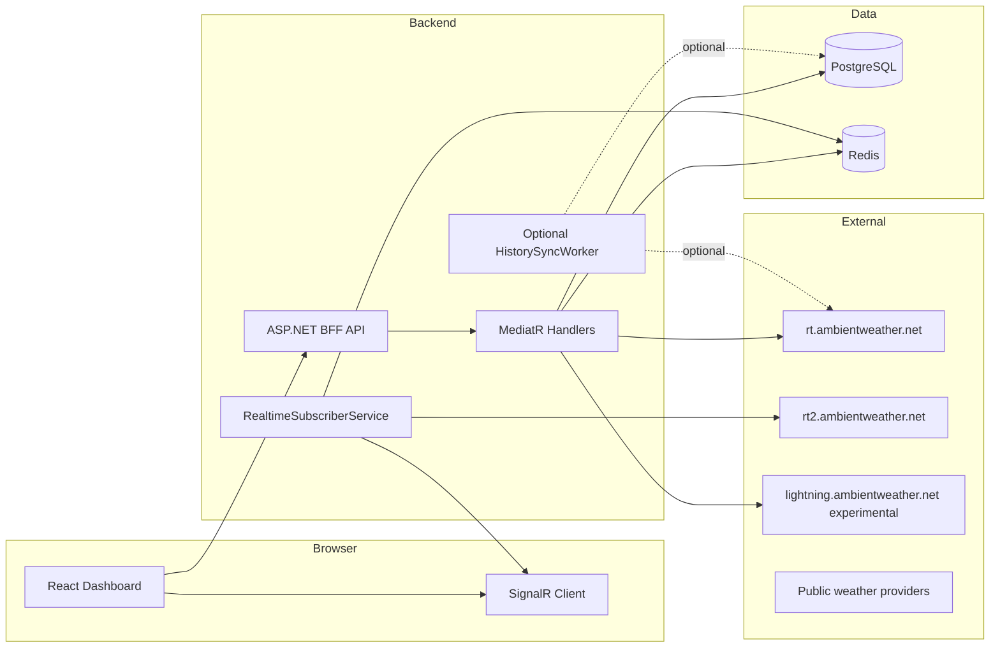

# Ambient Weather Dashboard — Development Plan

Decoupled full-stack web application for live and historical data from your Ambient
Weather devices. Click any metric for a customizable chart. Optionally compare against
other owned devices or an average of nearby public stations.

All dependencies and cloud services use 100% free tiers and open-source tools
(MIT, Apache 2.0, or BSD-3-Clause), optimized for local development.

---

## Goals

| Feature | Description |
|---|---|
| Live dashboard | Indoor/outdoor temp & humidity, pressure, UV/solar, wind speed, rainfall summaries |
| Rainfall breakdown | Last event, day, week, month, year (from station `lastData` fields) |
| Metric drill-down | Click a tile → detail view with customizable time-series chart |
| Historical date view | Pick a specific date to inspect that day's metric history |
| Neighbor compare | Toggle between your station and a best-effort average of nearby public stations/observations |
| Custom layout | Settings-managed Default/Custom dashboard layouts; custom blocks persisted per user |
| Realtime updates | Server-side Socket.IO subscriber → Redis pub/sub → browser push |
| Flexible devices | Support multiple owned devices, optional indoor/outdoor sensors, nicknames, and per-device metric choices |
| Accessibility | Target WCAG 2.2 Level AA conformance across all UI — keyboard navigation, sufficient contrast, focus management, drag alternatives, and minimum target sizes |

---

## Tech Stack

All packages are free and open source. Free-tier cloud services are used where applicable.

| Layer | Choice | Licence / Cost | Rationale |
|---|---|---|---|
| Backend | **.NET 10** ASP.NET Core Web API, MediatR, FluentValidation | MIT / Free | Clean Architecture, async I/O, strict validation |
| ORM & DB | EF Core + **PostgreSQL 16** | MIT / Open Source | App-owned state: users, encrypted credentials, preferences, layouts, device metadata. Raw weather time-series storage is optional/future. |
| Cache / pub-sub | **Redis 7** | BSD / Open Source | Ambient history page cache, rate-limit buckets, neighbor cache, realtime fan-out |
| Object storage | **Cloudflare R2** | Free Tier (10 GB/mo, zero egress) | S3-compatible; future exports and assets |
| Auth | **Auth0 Free Tier** *(or OpenIddict for fully self-hosted)* | Free Tier / MIT | Up to 7k active users; JWT Bearer; no keys in browser |
| Frontend | **React 19 + TypeScript + Vite on Node 24 LTS** | MIT / Free | Strict typing, lightning-fast HMR dev server, current Active LTS toolchain |
| UI | **shadcn/ui** + Tailwind CSS | MIT / Free | Accessible, unstyled, zero-bloat components |
| Server state | **TanStack Query** | MIT / Free | Centralized query keys, automatic cache invalidation |
| Charts | **Apache ECharts** via `echarts-for-react` | Apache 2.0 / Free | Best free option for zoom, brush, and multi-series charts |
| Layout grid | CSS Grid + structured settings builder | Native / Free | Default metric layout plus accessible Custom block ordering |
| Realtime (server) | `SocketIOClient` | MIT / Free | Ambient rt2 feed subscriber |
| Realtime (browser) | ASP.NET Core **SignalR** | MIT / Free | Push from backend after Redis pub/sub |
| Testing | xUnit, **Shouldly**, Vitest + RTL, **Playwright Test TS** | MIT / Apache 2.0 / BSD-3-Clause | Backend unit, readable assertions, frontend component, E2E fixtures/helpers |
| Code quality | .NET SDK analyzers, Meziantou.Analyzer, Roslynator.Analyzers, ESLint + React/a11y/test plugins | MIT / Apache 2.0 | Backend analyzers, frontend React/TypeScript/accessibility/test linting, CI enforcement |
| Logging / telemetry | Serilog + **Application Insights** behind app-owned telemetry wrapper | Free Tier (5 GB/mo) | Structured logs; links React traces to .NET backend while keeping RUM vendor swappable |
| CI/CD | **GitHub Actions** | Free Tier (2,000 min/mo) | Automated build, lint, test, deploy on PR |
| Ambient client | Custom `RateLimitedApiClient` wrapping `HttpClient` | — | Enforces 1 req/s; keys never leave server |

> **Helper libraries:** The [official Apiary list](https://ambientweather.docs.apiary.io/#introduction/helper-libraries)
> includes community .NET clients. This project uses a thin custom client so rate limiting,
> caching, and nearby public-provider calls stay in one place. Reference implementations:
> [ambient-dotnet](https://github.com/RyanCathcart/ambient-dotnet),
> [aioambient OpenAPI](https://github.com/bachya/aioambient).

---

## Architecture Overview



**Key rules**

- Ambient `apiKey` and `applicationKey` are stored **server-side only**, encrypted at rest.
- All Ambient HTTP traffic goes through `RateLimitedApiClient` (1 req/s per user key).
- Live tile values prefer Socket.IO `data` events; REST `/devices` is the fallback.
- History for v1 charts is fetched from Ambient history pages and cached in Redis/distributed cache.
- Local PostgreSQL weather-reading storage, backfill, and rollups are optional optimizations after v1 proves they are needed.
- **Never** connect browsers directly to Ambient Socket.IO — this would expose the application key and multiply connections.

---

## Data Model (PostgreSQL Schema)

Initial migration scope should focus on app-owned data. Ambient historical readings can be read from the
Ambient API and cached in Redis for v1; local weather time-series tables are listed as optional future
optimization if long-range performance, offline access, or API budget pressure require them.

### `users`

| Column | Type | Notes |
|---|---|---|
| `id` | `uuid` PK | Internal user id |
| `auth_provider_sub` | `varchar(256)` UNIQUE | Auth0 / OpenIddict subject |
| `email` | `varchar(256)` | Display only |
| `created_at` | `timestamptz` | |

### `user_ambient_credentials`

| Column | Type | Notes |
|---|---|---|
| `user_id` | `uuid` FK → `users` | One row per user |
| `api_key_encrypted` | `bytea` | ASP.NET Data Protection encrypted |
| `application_key_encrypted` | `bytea` | Same |
| `updated_at` | `timestamptz` | |

### `user_preferences`

| Column | Type | Notes |
|---|---|---|
| `user_id` | `uuid` FK | |
| `temperature_unit` | `varchar(8)` | `F` \| `C` |
| `speed_unit` | `varchar(8)` | `mph` \| `kmh` \| `ms` |
| `pressure_unit` | `varchar(8)` | `inhg` \| `hpa` \| `mbar` |
| `rainfall_unit` | `varchar(8)` | `in` \| `mm` |
| `theme` | `varchar(16)` | `light` \| `dark` \| `system` |
| `date_format` | `varchar(8)` | `mdy` \| `dmy` \| `iso` |
| `temperature_decimals` | `integer` | `0`, `1`, or `2` decimal places |
| `daily_extrema_timezone` | `varchar(8)` | `utc` \| `local` (station IANA tz; falls back to UTC) |
| `neighbor_config_json` | `jsonb` | User-defined neighbor variables (see Neighbor section) |
| `default_weather_station_id` | `uuid` FK NULL | FK to `weather_stations`; set on first sync |
| `updated_at` | `timestamptz` | |

### `dashboard_layouts`

| Column | Type | Notes |
|---|---|---|
| `id` | `uuid` PK | |
| `user_id` | `uuid` FK | |
| `name` | `varchar(128)` | e.g. `"Default"` |
| `is_active` | `bool` | One active layout per user |
| `layout_json` | `jsonb` | Settings-managed Default/Custom layout payload |
| `updated_at` | `timestamptz` | |

### `weather_stations`

| Column | Type | Notes |
|---|---|---|
| `id` | `uuid` PK | |
| `user_id` | `uuid` FK NULL | NULL for cached neighbor stations |
| `mac_address` | `varchar(17)` | Ambient MAC; unique per user |
| `name` | `varchar(256)` | |
| `nickname` | `varchar(128)` NULL | User-facing alias |
| `latitude` | `double precision` | |
| `longitude` | `double precision` | |
| `elevation_m` | `double precision` NULL | |
| `is_primary` | `bool` | User's default station |
| `display_on_dashboard` | `bool` | Whether this device appears in the dashboard device selector |
| `selected_metric_keys_json` | `jsonb` NULL | Per-device metric selection for flexible dashboards |
| `last_sync_at` | `timestamptz` NULL | |

### Optional Future: `weather_readings`

Only add when v1 Ambient API + Redis caching is not enough. Time-series rows synced from
`/v1/devices/{macAddress}`.

| Column | Type | Notes |
|---|---|---|
| `id` | `bigint` PK | |
| `station_id` | `uuid` FK → `weather_stations` | |
| `recorded_at_utc` | `timestamptz` | From `dateutc` |
| `outdoor_temp_f` | `real` NULL | `tempf` |
| `indoor_temp_f` | `real` NULL | `tempinf` |
| `outdoor_humidity` | `real` NULL | |
| `indoor_humidity` | `real` NULL | |
| `pressure_inhg` | `real` NULL | `baromrelin` |
| `uv_index` | `smallint` NULL | |
| `solar_w_m2` | `real` NULL | `solarradiation` |
| `wind_speed_mph` | `real` NULL | |
| `wind_direction_deg` | `smallint` NULL | |
| `hourly_rain_in` | `real` NULL | `hourlyrainin` |
| `daily_rain_in` | `real` NULL | Snapshot field |
| `raw_json` | `jsonb` NULL | Full payload for forward compatibility |

**Index:** `(station_id, recorded_at_utc DESC)` UNIQUE.

### Optional Future: `reading_aggregates`

Only add with local time-series storage. Pre-computed rollups for long-range charts.

| Column | Type | Notes |
|---|---|---|
| `id` | `bigint` PK | |
| `station_id` | `uuid` FK | |
| `metric_key` | `varchar(64)` | e.g. `outdoor_temp_f` |
| `bucket_start_utc` | `timestamptz` | Hour or day start |
| `granularity` | `varchar(8)` | `hour` \| `day` |
| `avg_value` | `real` NULL | |
| `min_value` | `real` NULL | |
| `max_value` | `real` NULL | |
| `sum_value` | `real` NULL | Used for rain accumulation |

**Index:** `(station_id, metric_key, granularity, bucket_start_utc)` UNIQUE.

### Optional Future: `history_sync_cursors`

| Column | Type | Notes |
|---|---|---|
| `station_id` | `uuid` PK FK | |
| `oldest_fetched_utc` | `timestamptz` | Pagination watermark |
| `last_run_at` | `timestamptz` | |
| `last_error` | `text` NULL | |

### `neighbor_station_cache`

Stores the most recently discovered nearby public stations per user. No FK to `weather_stations` — these are external public stations, not owned devices.

| Column | Type | Notes |
|---|---|---|
| `id` | `uuid` PK | |
| `user_hash` | `varchar(64)` | Hashed user subject (no FK; avoids coupling to auth provider) |
| `provider` | `varchar(64)` | `AmbientOpen` \| `WeatherGov` \| `OpenMeteo` |
| `source_id` | `varchar(256)` | Provider-specific station identifier |
| `name` | `varchar(256)` | Human-readable station name |
| `lat` | `double precision` | |
| `lon` | `double precision` | |
| `distance_miles` | `real` | Haversine from user's primary station |
| `last_observed_at_utc` | `timestamptz` | Timestamp of the station's last reading |
| `freshness_minutes` | `integer` | Age of last reading at cache time |
| `raw_reading_json` | `text` | Full provider payload for forward-compat |
| `cached_at_utc` | `timestamptz` | When this row was written |

**Unique index:** `(user_hash, provider, source_id)`. Redis key `neighbor-list:{userHash}` holds the assembled sorted list with TTL = `refreshIntervalMinutes`.

---

## Security Model

Desktop DPAPI storage (`docs/SECURITY.md`) does **not** apply to this web application.

| Concern | Approach |
|---|---|
| User identity | Auth0 Free Tier JWT (or OpenIddict) — subject stored in `users.auth_provider_sub` |
| Ambient keys | Entered once in Settings UI → encrypted with **ASP.NET Core Data Protection** → stored in `user_ambient_credentials` |
| Keys in transit | HTTPS only; keys posted to authenticated endpoint, never returned to client |
| Keys in logs | Redact `apiKey` / `applicationKey` via Serilog destructuring policy |
| Browser | JWT in memory or httpOnly cookie; **never** expose Ambient keys to React |
| Secrets config | `.NET User Secrets` locally; GitHub Actions Secrets for CI — **no hardcoded keys** |
| Ambient proxy | All Ambient calls originate from backend services only |
| Rate abuse | `Microsoft.AspNetCore.RateLimiting` on BFF + Redis-backed token bucket for outbound Ambient queue |

**Settings flow:** authenticated user → `POST /api/settings/credentials` → validate with test call to `/v1/devices` → encrypt → save.

---

## Backend API Contract (BFF)

All routes require `Authorization: Bearer {jwt}` unless noted.

### Dashboard & layout

| Method | Route | Response |
|---|---|---|
| `GET` | `/api/dashboard/current` | Live tile payload from Redis cache / realtime. `?source=neighbors` returns aggregated neighbor reading. |
| `GET` | `/api/dashboard/rainfall` | `{ event, day, week, month, year }` from `lastData` |
| `GET` | `/api/dashboard/daily-extremes` | Today's high/low outdoor/indoor temps (DB primary; Ambient REST fallback) |
| `GET` | `/api/dashboard/layout` | Active `dashboard_layouts.layout_json` |
| `PUT` | `/api/dashboard/layout` | Save layout JSON |

### Metrics & charts

| Method | Route | Query params | Response |
|---|---|---|---|
| `GET` | `/api/metrics` | — | Catalog of available metrics + units |
| `GET` | `/api/metrics/{metricKey}/history` | `range`, `from`, `to`, `date`, `granularity`, `source`, `deviceId` | Time series for ECharts |
| `GET` | `/api/metrics/{metricKey}/current` | `source=my\|neighbors` | Single current value |

**`source` values:** `my` (default), `neighbors` (aggregated).
**`range` presets:** `24h`, `7d`, `30d`, `90d`, `1y`, `custom` (requires `from` + `to`), `date` (requires `date`).
**Specific date mode:** `range=date&date=YYYY-MM-DD` returns readings for that calendar day in the user's station timezone.
**Device selection:** `deviceId` selects one owned device; omit it to use the user's default/primary device.

### Neighbors

| Method | Route | Response |
|---|---|---|
| `GET` | `/api/neighbors/config` | User's `neighbor_config_json`; seeds default on first access |
| `PUT` | `/api/neighbors/config` | Update neighbor config (FluentValidation) |
| `POST` | `/api/neighbors/refresh` | Clears Redis cache, triggers re-discovery, returns updated station list (rate-limited) |

### Settings & realtime

| Method | Route | Notes |
|---|---|---|
| `GET` | `/api/settings/preferences` | Units, theme |
| `PUT` | `/api/settings/preferences` | |
| `POST` | `/api/settings/credentials` | Save Ambient keys (encrypted) |
| `DELETE` | `/api/settings/credentials` | Logout / clear keys |
| `GET` | `/api/health` | Unauthenticated liveness |
| *Hub* | `/hubs/weather` | SignalR — `ReadingUpdated`, `DashboardRefresh` events |

---

## Metric Catalog

Tiles and charts share a single metric registry (`MetricDefinition` in backend, mirrored in frontend TypeScript types).
Metrics are filtered per device based on available sensors and the user's selected metric list.

| Key | Label | Source field | Neighbor avg? |
|---|---|---|---|
| `outdoor_temp` | Outdoor temp | `tempf` | Yes |
| `indoor_temp` | Indoor temp | `tempinf` | No (user station only) |
| `outdoor_humidity` | Outdoor humidity | `humidity` | Yes |
| `indoor_humidity` | Indoor humidity | `humidityin` | No |
| `pressure` | Pressure | `baromrelin` | Yes |
| `uv_index` | UV index | `uv` | Yes (skip nulls) |
| `solar_radiation` | Solar radiation | `solarradiation` | Yes (skip nulls) |
| `wind_speed` | Wind speed | `windspeedmph` | Yes |
| `rainfall_event` | Last event | `eventrainin` | Yes |
| `rainfall_day` | Today | `dailyrainin` | Yes |
| `rainfall_week` | This week | `weeklyrainin` | Yes |
| `rainfall_month` | This month | `monthlyrainin` | Yes |
| `rainfall_year` | This year | `yearlyrainin` | Yes |

---

## Device Flexibility & Feature Ideas

Users may own multiple Ambient devices, and those devices may or may not be co-located. Some users may
have only indoor sensors, only outdoor sensors, or devices with a partial metric set. The dashboard should
therefore be device-aware instead of assuming one fully populated station.

| Feature | v1 Approach |
|---|---|
| Device nicknames | Let users assign friendly names to devices returned by `/v1/devices` |
| Device display selection | Let users choose which devices appear on the dashboard |
| Per-device metric selection | Let users choose which metrics to show for each device |
| Single-device view | Allow the dashboard and metric detail pages to focus on one selected device at a time |
| Device comparison | Compare metrics between owned devices, such as indoor vs outdoor or two outdoor stations |
| Partial sensor support | Hide unavailable metrics by default and show clear empty states when selected metrics are missing |
| Future context APIs | Consider public weather and map APIs later for broader context, maps, forecasts, or third-party historical comparison |

These features should be implemented without exposing Ambient API keys to the browser. Device metadata,
nicknames, dashboard visibility, and per-device metric choices belong in PostgreSQL; historical readings can
still be served from Ambient API pages plus Redis cache unless local storage becomes necessary.

---

## Realtime Architecture

```
Ambient rt2 Socket.IO
        │
        ▼
RealtimeSubscriberService (BackgroundService — one connection per app instance)
        │  parse "data" event → WeatherReadingDto
        ▼
Redis PUBLISH ambient:readings:{userId}
        │
        ▼
SignalR WeatherHub → group "user:{userId}"
        │
        ▼
React useWeatherHub() → update TanStack Query keys
```

| Step | Detail |
|---|---|
| Subscribe | On user login / first dashboard load, ensure user's `apiKey` is in subscriber's subscribe set |
| Reconnect | Exponential backoff 1s → 30s max |
| Fallback | If Socket.IO down > 60s, poll `/v1/devices` every 60s (respects rate limit) |
| Redis | Cache latest reading JSON with 5-minute TTL for REST fallback |

---

## Chart Customization (ECharts)

Detail view (`/metrics/:metricKey`) exposes user controls; persisted in session storage initially, optional DB persistence later.

| Control | Options |
|---|---|
| Time range | Presets + custom date range picker + specific date picker |
| Granularity | Auto (5m / 1h / 1d based on range) or manual override |
| Chart type | Line, area, bar (rain forced to bar) |
| Comparison | Overlay neighbor average series |
| Device | Select one owned device, all dashboard devices, or compare selected devices |
| Y-axis | Auto scale or fixed min/max |
| Zoom | ECharts dataZoom (brush + slider) |

---

## Dashboard Layout

Phase 10 uses a settings-managed layout model instead of a drag-first visual page builder.
The Settings > My Stations area provides a `Default` / `Custom` segmented control.

| Item | Detail |
|---|---|
| Default mode | Current metric category/field selection and ordering |
| Custom mode | Ordered layout builder for metric blocks, dividers, header tickers, and footer tickers |
| Grid model | 3-column dashboard grid with ordered auto-flow |
| Allowed sizes | `1x1`, `1x2`, `1x3`, `2x1`, `2x2`, `2x3`, `3x1`, `3x2`, `3x3` |
| Limit | Max 12 custom layout items in Phase 10 |
| Metric blocks | User-named blocks containing ordered metrics from any owned/synced station |
| Fill tile mode | Single-metric blocks can render a top label plus large readable value |
| Dividers | Named or blank dividers; default full-row compact size (`3x1`) |
| Tickers | Header/footer ticker items; default `3x1`; local weather fields first, external alerts later |
| Persistence | `PUT /api/dashboard/layout` saves mode + JSON; restored on every dashboard load |

Custom v1 should remain an accessible ordered form/editor with a read-only preview. Do not
make drag/drop the primary interaction. Reordering, size changes, metric selection, fill-mode
selection, and ticker pause/stop controls must work by keyboard.

---

## Neighbor Stations — User-Defined Variables

Stored in `user_preferences.neighbor_config_json`:

```json
{
  "isEnabled": false,
  "radiusMiles": 25,
  "maxAgeMinutes": 30,
  "minStations": 3,
  "enabledProviders": ["WeatherGov", "OpenMeteo"],
  "refreshIntervalMinutes": 15
}
```

| Variable | Default | Range | Description |
|---|---|---|---|
| `isEnabled` | `false` | — | Master toggle for neighbor compare mode |
| `radiusMiles` | `25` | 5–50 | Bounding-box search radius |
| `maxAgeMinutes` | `30` | 5–120 | Ignore stations with last reading older than this |
| `minStations` | `3` | 1–20 | Show `isBelowMinStations` warning if fewer stations report |
| `enabledProviders` | `["WeatherGov","OpenMeteo"]` | `AmbientOpen`, `WeatherGov`, `OpenMeteo` | Active discovery providers in priority order |
| `refreshIntervalMinutes` | `15` | 5–60 | Redis TTL for cached neighbor list |

Aggregation is always mean (per-field, null-excluded). Wind direction uses circular mean to handle the 0°/360° wrap. `AmbientOpen` is feature-flagged via `Features:AmbientOpenApiEnabled` (default `false`).

**Discovery:** Neighbor comparison is provider-based. Ambient's undocumented Open REST API appears to
support public station discovery through `GET https://lightning.ambientweather.net/devices` with
`$publicBox` bounding-box parameters and public current detail through `GET /devices/{macAddress}` (see
[`NEIGHBOR_DATA_RESEARCH.md`](NEIGHBOR_DATA_RESEARCH.md)). Because this API is undocumented, Phase 11
must place it behind an `INearbyWeatherProvider` abstraction and a feature flag.

**Fallback providers:** If Ambient public station data is unavailable or unstable, use other free public
providers behind the same abstraction. Preferred v1 candidates are Weather.gov/NWS for U.S. official
observations and Open-Meteo for global no-key model-based baseline data. NOAA NCEI Climate Data Online is
a later historical-data candidate if a free token is configured.

**Rate-limit strategy:** cache discovery and current observations in `neighbor_station_cache` + Redis,
refresh on the configured interval, and never fan out 10 provider calls on every page load. Historical
neighbor charts remain deferred unless a provider supports safe historical station observations or the app
has cached enough neighbor current samples over time.

---

## Historical Data Strategy

The Ambient history endpoint returns max **288 records** per request. At 5-minute resolution this is
roughly one day per page; some devices report at 30-minute intervals. Requests page backward from
`endDate`, or from the most recent history when `endDate` is omitted.

For v1, historical charts should use Ambient history pages directly through the backend, with Redis or
`IDistributedCache` caching each page/request. This avoids building and maintaining local weather
time-series storage before it is needed.

See [`AMBIENT_HISTORY_API_RESEARCH.md`](AMBIENT_HISTORY_API_RESEARCH.md) for the endpoint behavior,
call-budget estimates, and rationale behind this v1 strategy.

### Supported v1 history modes

| Mode | Query | Backend behavior |
|---|---|---|
| Recent preset | `range=24h`, `7d`, `30d`, `90d`, `1y` | Calculate required pages, fetch via Ambient REST with rate limiting, cache page responses |
| Custom range | `range=custom&from=...&to=...` | Page backward from `to` until `from`, trim results to the exact range |
| Specific date | `range=date&date=YYYY-MM-DD` | Resolve the day in the station/user timezone, page backward from end-of-day, trim to that calendar day |

### Optional future local sync

| Job | Schedule | Action |
|---|---|---|
| `HistorySyncWorker` | Every 5 min | Optional: fetch latest page from `/v1/devices/{mac}`, upsert into `weather_readings` |
| Backfill | On credential save + nightly | Optional: page backwards with `endDate` until 1 year reached or API empty |
| Rollup | Hourly | Optional: compute `reading_aggregates` (hour → day) for chart queries |
| Rainfall charts | — | Use `hourlyrainin` summed into buckets; snapshot fields (`dailyrainin`, etc.) for tiles only |

Add local sync only if Ambient API + Redis cache is too slow, API budget becomes a problem, offline
history is required, or long-range aggregations need pre-computation.

---

## Testing Strategy

**Every component and handler gets tests before a phase is considered complete.**

| Layer | Tool | Scope |
|---|---|---|
| Backend handlers | xUnit + `WebApplicationFactory` | Each MediatR query/command, validators, mappers |
| Backend services | xUnit + Moq | Rate limiter, neighbor aggregator, sync worker |
| Frontend components | Vitest + React Testing Library | Each tile, chart controls, layout editor, settings form |
| Frontend hooks | Vitest | TanStack Query hooks, SignalR hook, unit converters |
| E2E | Playwright Test TypeScript | Login, dashboard load, tile click -> chart, layout save, neighbor toggle |
| Contract | OpenAPI snapshot | BFF response shapes match frontend TypeScript interfaces |
| Accessibility | `axe-core` via Playwright + RTL `jest-axe` | WCAG 2.2 AA automated scan on every page; manual keyboard and screen-reader checks at each UI phase |

**E2E observability:** trace + video + screenshot on first retry.
**Test isolation:** each Playwright test uses a fresh `BrowserContext`; DB seeded and torn down via API helpers.

---

## Project Structure

```
/
├── backend/
│   ├── src/
│   │   ├── AmbientWeather.Api/             # Controllers, SignalR hub, DI registration
│   │   ├── AmbientWeather.Application/     # MediatR handlers, validators, DTOs
│   │   ├── AmbientWeather.Domain/          # Entities, MetricDefinition, domain exceptions
│   │   ├── AmbientWeather.Infrastructure/
│   │   │   ├── Ambient/                    # RateLimitedApiClient, OpenApiClient, RealtimeSubscriber
│   │   │   ├── Persistence/                # EF Core DbContext, migrations, repositories
│   │   │   └── Redis/                      # Cache + pub/sub
│   │   └── AmbientWeather.Workers/         # Optional HistorySyncWorker / future rollups
│   └── tests/
│       ├── AmbientWeather.UnitTests/
│       └── AmbientWeather.IntegrationTests/
├── frontend/
│   ├── src/
│   │   ├── components/                     # MetricTile, RainfallSummaryTile, etc. (each with *.test.tsx)
│   │   ├── hooks/                          # useWeatherHub, useDashboard, useMetricHistory
│   │   ├── pages/                          # Dashboard, MetricDetail, Settings
│   │   ├── api/                            # Typed fetch clients + query key factory
│   │   └── types/                          # Shared TypeScript interfaces mirroring backend DTOs
│   └── vitest.config.ts
├── tests/
│   └── e2e/                                # Playwright TypeScript E2E suite
├── docker-compose.yml                      # PostgreSQL + Redis with health checks
├── .env.example                            # Local connection strings — no secrets
└── docs/
    ├── DEVELOPMENT_PLAN.md                 # This file
    ├── API_REFERENCE.md                    # Ambient field mapping
    └── SECURITY.md                         # Web auth, credential encryption, rate limiting
```

---

## API Rate-Limit Budget (Planning Reference)

| Operation | Approx. calls | Notes |
|---|---|---|
| Initial login | 1 | `/v1/devices` — validate credentials |
| One-day historical date view | 1 | One page at 5-min resolution; cache by device/date |
| 7-day history | ~7 | Page backward with `endDate`; cache pages |
| 30-day history | ~30 | Use background fetch/progress UI if not cached |
| 1-year history | ~365 | Feasible but slow at 1 req/sec; cache aggressively or defer/export asynchronously |
| Optional steady-state sync | 1 per 5 min | Latest page only, if local storage is enabled later |
| Neighbor refresh | 1 | Provider discovery/cache refresh — no user Ambient key needed |
| Realtime | 0 REST | Socket.IO push replaces polling |

Design user-facing endpoints to read app-owned state from **PostgreSQL**, cached history/current values
from **Redis**, and Ambient REST only through backend services with rate limiting. Historical chart endpoints
may call Ambient when a requested page is not cached.

---

## Current Implementation Snapshot

Last reviewed against the codebase on 2026-06-09 after completing Phase 11.

| Area | Status | Current reality |
|---|---|---|
| Repository scaffold | Complete | Monorepo, backend solution, frontend Vite scaffold, E2E project, Docker Compose, `.env.example`, and CI present. `FORCE_JAVASCRIPT_ACTIONS_TO_NODE24` env var suppresses Node 20 deprecation warnings in GitHub Actions. |
| Backend API shell | Mostly complete | ASP.NET Core API with Swagger, health endpoints, global exception middleware, JWT-protected controllers for settings, metrics, dashboard, and neighbors. `NeighborsController` (`GET/PUT /api/neighbors/config`, `POST /api/neighbors/refresh`) implemented in Phase 11. |
| Frontend shell | Complete (Phase 3 scope) | Tailwind v4, shadcn/ui, React Router v7, TanStack Query v5, Auth0, `MockAuthProvider`, typed BFF client, `AppProviders`, `ThemeProvider`, WCAG 2.2 AA shell baseline. |
| Testing scaffold | Mostly complete | Backend unit/integration, frontend Vitest, and Playwright TypeScript E2E coverage are active. Redis→SignalR E2E (Testcontainers-Redis), reconnect-state test, route-navigation regression E2E, neighbor/public-source tests, and the Phase 11 8C benchmark are complete. |
| Ambient REST | Mostly complete | `RateLimitedApiClient`, `AmbientRestClient`, `AmbientHistoryService`. Three neighbor providers implemented: `AmbientOpenWeatherProvider` (feature-flagged), `WeatherGovNearbyObservationProvider`, `OpenMeteoNearbyBaselineProvider`. |
| Caching | Mostly complete | Redis distributed cache + pub/sub. History page cache (Phase 8), latest-reading cache (Phase 9), neighbor list cache `neighbor-list:{userHash}` with TTL = `refreshIntervalMinutes` (Phase 11). Phase 11 8C benchmark found assembled response cache unnecessary at current latency. |
| Persistence | Mostly complete | EF Core; 14 migrations applied. `neighbor_station_cache` table, `DailyExtremaTimezone` and `NeighborConfigJson` columns on `user_preferences`, station timezone field (`Tz`) on `weather_stations`. `weather_readings` exists; local sync is optional future work. |
| Security | Complete (Phase 2/7/9 scope) | Data Protection, JWT Bearer + `AuthenticatedUser` policy, encrypted credential store, `SensitivePropertyRedactor`. No raw subject-prefix logging. |
| Workers | Partial | `HistorySyncWorker` syncs per-user stations. Local `weather_readings` hardening remains optional future work. |
| Product BFF routes | Mostly complete through Phase 11 | All Phase 10 routes plus `GET /api/dashboard/daily-extremes`, `GET /api/dashboard/current?source=neighbors`, `GET/PUT /api/neighbors/config`, `POST /api/neighbors/refresh`, `GET /api/public-sources/discover`, `GET/POST/PUT/DELETE /api/public-sources`, `GET /api/public-sources/{id}/current`, and `GET /api/alerts/active`. Neighbor, public-source, alerts, ticker channel/zone, and Default Settings source-management paths are implemented. |
| Frontend neighbor UI | Complete (Phase 11 Section 6) | `NeighborsConfigPanel`, `NeighborsStationDrawer`, Default-layout `Own Station / Neighbors` segmented control in `DashboardPage`, 3 hooks, types + API client. Custom layouts hide neighbor mode because neighbor comparison is a Default-layout aggregate view. |

### Near-Term Priority

Phase 11 is complete. Phase 12 now owns metric detail charts, API contract hardening, and
production-readiness follow-up work.

### Deferred Work Ledger

| Deferred item | Source phase | Target phase/status |
|---|---:|---|
| Full Settings forms and settings-device UI | 3 | Completed in Phase 7 |
| React Router pre-mount navigation concern | 3 fix review | Completed in Phase 11 Section 0 (route-navigation regression E2E) |
| Real browser E2E activation, CI-owned frontend server, P0/P1 split, traces/videos | 4 | Phase 9 activated P0 smoke tests + traces; CI-owned server startup completed in Phase 11 Section 0 |
| OpenAPI snapshot ↔ TypeScript contract test | 4 | Phase 12, after product DTOs stabilize |
| Cloudflare R2/export asset work | 5 | Removed from Phase 12; R2 remains future/deployment asset persistence only if remote storage is required |
| `AmbientHistoryService` paged range/date assembly | 6 | Completed in Phase 8 |
| `AmbientOpenApiClient` neighbor discovery | 6 | Completed in Phase 11 Section 2 (`AmbientOpenWeatherProvider`, feature-flagged) |
| Repository station/default invariant tests | 7 | Completed in Phase 8 |
| Credential-save station auto-sync atomicity decision | 7 | Completed in Phase 8; kept non-atomic by design |
| Realtime SignalR pipeline | 7/8 | Completed in Phase 9 |
| Dashboard current/rainfall tiles and layout editor | 7/8 | Completed in Phase 10 |
| `useMetricHistory` hook | 8 | Phase 12 chart UI |
| Assembled history/dashboard-response cache | 8/9 | Phase 11 Section 8C — measure first; add only if `source=neighbors` p95 > 200 ms |
| Cache invalidation on credential rotation | 8/9 | Bounded by 60-second refetch; documented in Phase 10 |
| Duplicate/shared MAC realtime routing | 9 PR review | Completed in Phase 10 gate (list-based routing) |
| Raw subject-prefix realtime invalidation log | 9 PR review | Completed in Phase 10 gate (renamed to HashPrefix) |
| Redis subscriber queue task supervision | 9 PR review | Completed in Phase 10 gate |
| Frontend/backend `CurrentReadingDto` parity | 9 PR review | Completed in Phase 10 gate |
| P0 settings credential-save E2E | 9 PR review / QA rules | Completed in Phase 9; carried to Phase 10 |
| E2E page-object action cleanup | 9 PR review / QA rules | Completed in Phase 10 |
| Redis→SignalR E2E push and `useWeatherHub` reconnecting-state coverage | 9 | Completed in Phase 11 Section 0 |
| CI-owned frontend/API server startup for Playwright | 4/10 | Completed in Phase 11 Section 0 |
| Route-navigation regression E2E | 3/10 | Completed in Phase 11 Section 0 |
| UTC vs local calendar-day preference for daily extrema and history date-range | pre-11 | Completed in Phase 11 Section 5 (`DailyExtremaTimezone`, `ResolveDateRangeUtc`) |
| Neighbor config, discovery, aggregation, and backend API | 11 | Completed in Phase 11 Sections 1–4 |
| Historical neighbor charts | 11 planning | Deferred until provider support or cached samples exist (Phase 12+) |
| User-selected Weather.gov/Open-Meteo source stations in Default/Custom layouts | 11 planning | Completed in Phase 11 Sections 8A + 8E |
| Public weather alerts (NWS) API, dashboard banner/ticker, header/footer crawlers | 11 | Completed in Phase 11 Sections 8B + 8D Feature 4 |
| Public source discovery by zipcode/city+state | 11 | Completed in Phase 11 Section 8D Feature 2 |
| Pinned stations as custom layout metric sources | 11 | Completed in Phase 11 Section 8D Feature 3 |
| Ticker channel source + per-ticker NWS alerts zone | 11 | Completed in Phase 11 Section 8D Feature 4 |
| Public/pinned source management in Default Settings station list | 11 | Completed in Phase 11 Section 8E, including per-source metric-key persistence |
| Assembled response cache measurement | 11 | Completed in Phase 11 Section 8C; local benchmark p95 2.70 ms, so assembled cache not needed |
| Neighbor frontend UI (`NeighborsConfigPanel`, drawer, dashboard toggle) | 11 | Completed in Phase 11 Section 6 |
| Phase 11 tests (backend unit/integration, frontend, E2E) | 11 | Completed in Phase 11 Section 7 |
| Open-Meteo extended metrics (weather condition, cloud cover, precipitation probability, sunrise/sunset, daily forecast values) | 11 public-source follow-up | Phase 12+ provider-specific metric expansion |
| Penetration testing / DAST suite (OWASP ZAP or equivalent, plus documented manual checks) | Security hardening | Future security hardening phase |
| Local PostgreSQL raw-reading sync hardening | 2/6 | 2.0 candidate; required before first-class offline cached history |

### Version 2.0 Feature Candidates

- **Offline cached history mode** — when Ambient credentials are missing or removed, show only
  locally cached historical data in a clearly labeled read-only mode: “Cached history only.
  Re-enter credentials to refresh.” Do not use live/current wording, and do not show refresh
  controls that imply new Ambient data can be fetched.
- **Local history hardening** — make PostgreSQL raw-reading sync, backfill, retention, and rollups
  production-ready before relying on offline history for long ranges.
- **Provider history overlays** — enable Weather.gov, Open-Meteo, Ambient Open, or pinned-source
  chart overlays only after provider history or cached samples can produce honest time series.
- **Offline freshness indicators** — show last cached timestamp, covered date range, and missing-gap
  warnings anywhere cached history is displayed.

---

## Execution Phases

### Phase 1 — Local Infrastructure & Workspace Setup ✅ COMPLETED
- ✅ Initialize monorepo (`/backend`, `/frontend`, `/tests/e2e`)
- ✅ `docker-compose.yml` — PostgreSQL + Redis with health checks
- ✅ `.env.example` for local connection strings (no secrets)
- ✅ GitHub Actions CI: lint, build backend/frontend, run unit tests

### Phase 2 — ASP.NET Core Backend Foundations ✅ COMPLETED
- ✅ Bootstrap .NET 10 Web API project structure
- ✅ Clean Architecture slices (`Api`, `Application`, `Domain`, `Infrastructure`, `Workers`); MediatR + FluentValidation wired with `ValidationBehavior` pipeline; `GetDeviceHistoryQuery` handler proves the pattern
- ✅ EF Core + PostgreSQL model and repository registration; `InitialCreate` + `AddSchemaInvariants` migrations; `DesignTimeDbContextFactory`; schema invariants enforced (one active layout, one primary station, FK from preferences to station)
- ✅ Auth0 (or OpenIddict) JWT Bearer wired + startup guard; `ICurrentUserService` resolves claims; `AuthenticatedUser` policy; `[Authorize]` on all protected controllers; `TestAuthHandler` for integration tests
- ✅ ASP.NET Data Protection for credential encryption service (text columns, stable app name, persistent key ring)
- ✅ Server-side encrypted Ambient credential store/retrieval; `GET/POST/DELETE /api/settings/credentials` and `GET/PUT /api/settings/preferences` all using per-user credential-store flow
- ✅ Redis distributed cache registration with Development/Testing fallback
- ✅ `Microsoft.AspNetCore.RateLimiting` BFF rate limiter — 60 req/min per user/IP, `[EnableRateLimiting("per-user")]` on `DeviceHistoryController`
- ✅ `.NET User Secrets` for Auth0 / Redis / Postgres locally; README setup section updated
- ✅ OpenAPI / Swagger at `/swagger` — Authorize button with Bearer JWT definition + `AuthorizeCheckOperationFilter`; per-operation filter only (no duplicate global requirement)
- ✅ Global exception handling middleware
- ✅ Temporary application-key middleware for protected device endpoints
- ✅ Backend analyzer baseline: .NET SDK analyzers, Meziantou.Analyzer, Roslynator.Analyzers

#### Phase 2 closeout checklist

**Priority 1 — broken runtime paths and secret exposure**
- ✅ Remove Ambient `apiKey` and `applicationKey` from `DeviceHistoryController` query parameters, XML docs, Swagger contract, MediatR query, validators, and tests.
- ✅ Update the history query path to resolve `ICurrentUserService.AuthProviderSubject`, load credentials via `IAmbientCredentialStore`, and reject missing credentials with a typed application error.
- ✅ Add user/station ownership checks before any device-history/cache operation; cache invalidation scoped by user + device (user subject embedded in all version keys).
- ✅ Fix `DeviceHistoryService.GetDeviceHistoryAsync` so cache misses do not call the unsupported credential-less Ambient REST overload.
- ✅ Fix `HistorySyncWorker.SyncConfiguredDeviceAsync` by removing the legacy configured-device credential-less path or changing it to use configured/server-side credentials explicitly.
- ✅ Remove or make private the unsupported credential-less `IAmbientRestClient.GetDeviceHistoryAsync` overload once no production code depends on it.

**Priority 2 — app-owned data model and migrations**
- ✅ Correct `AmbientWeatherDbContextFactory` to load configuration/user secrets from the API startup project or shared local config, and remove the mismatched hardcoded fallback.
- ✅ Deferred `weather_readings` ownership invariants to optional future local sync. Table stays in migration but station FK and idempotency index are not Phase 2 scope.
- ✅ Enforce one active dashboard layout per user and one primary station per user with filtered unique indexes (`AddSchemaInvariants` migration).
- ✅ Add a FK for `UserPreferences.DefaultWeatherStationId` to `WeatherStation` (`AddSchemaInvariants` migration; `OnDelete(SetNull)`).
- ✅ Credential columns are `text` (Data Protection base64 strings). `SECURITY.md` updated to match.
- ✅ `.AsNoTracking()` on read-only EF queries; migration invariant tests assert unique indexes and FK (`SchemaInvariantTests`).

**Priority 3 — auth, settings, and credential flow**
- ✅ Add `POST /api/settings/credentials` with FluentValidation, Ambient `/v1/devices` validation through `RateLimitedApiClient`, encryption, and upsert.
- ✅ Add `DELETE /api/settings/credentials` and a safe credentials status response that never returns decrypted values.
- ✅ Configure Data Protection with a stable application name and persistent key ring shared by API and Worker.
- ✅ Development `RequireAssertion(_ => true)` bypass retained for Swagger-only local use. `TestAuthHandler` registered as default scheme in `Testing` environment for all integration tests.
- ✅ Integration tests: valid JWT success, current-user resolution, missing/invalid credentials, user isolation, keys never appear in GET responses (`SettingsCredentialsApiTests`, `SettingsPreferencesApiTests`).

**Priority 4 — rate limiting, Swagger, and cleanup**
- ✅ Move outbound Ambient retry attempts through the rate limiter so retries respect 1 req/sec per API key and 3 req/sec per application key.
- ✅ Circuit-breaker-open failures map to 503 `ambient-unavailable` via `AmbientCircuitOpenException` caught in `GlobalExceptionHandlerMiddleware`.
- ✅ Remove duplicate Swagger Bearer security requirements by choosing either the global requirement or per-operation `AuthorizeCheckOperationFilter`, not both.
- ✅ Fix the stale `RateLimitTests` middleware-order comment and remove the unused `appKeyRequest` allocation.
- ✅ Fix temporary application-key middleware error wording so it only documents the supported `x-application-key` header.
- ✅ `PHASE_2_COMPLETION_PLAN.md`, `SECURITY.md`, and `DEVELOPMENT_PLAN.md` updated.

### Phase 3 — Vite + React Frontend Shell ✅ COMPLETED
- ✅ Bootstrap Vite React-TS scaffold
- ✅ Preflight dependency/license check before installs:
  - Confirm every added npm package is MIT, Apache 2.0, or BSD-3-Clause and actively maintained.
  - Expected candidates: Tailwind CSS, shadcn/ui/Radix primitives, `class-variance-authority`, `clsx`, `tailwind-merge`, `lucide-react`, React Router, TanStack Query, Auth0 React SDK or an approved OIDC client, and `jest-axe`.
  - Record any package/version/license decisions that affect project rules or setup docs.
- ✅ Tailwind CSS + shadcn/ui foundation:
  - Tailwind v4 via `@tailwindcss/vite` plugin; oklch-based CSS variables; `@theme inline` for runtime dark-mode switching.
  - shadcn/ui primitives: Button, Card, Input, Label, Alert, Skeleton, Tooltip, DropdownMenu (all MIT/Apache 2.0).
  - All colours centralized in CSS variables; no hardcoded hex in components.
- ✅ App shell and routing:
  - React Router v7 (library mode); routes for `/`, `/settings`, `/metrics/:metricKey`, `/auth/callback`, `*`.
  - Semantic landmarks: `<header>`, `<nav>`, `<main id="main-content">`, `<footer>`.
  - `ErrorBoundary` (class component) + `NotFoundPage` + `AuthCallbackPage`.
- ✅ Provider composition:
  - `AppProviders` composes ThemeProvider → AppAuthProvider → QueryClientProvider → RouterProvider.
  - TanStack Query v5 defaults: 1 retry, 30s stale time, no window-refocus refetch.
  - Query key factory at `frontend/src/lib/queryKeys.ts`.
- ✅ Auth login flow + JWT handling:
  - Auth0 tenant configured via local environment/user-secrets values, audience `https://ambient-weather-dashboard-api`.
  - `AppAuthProvider` wraps `Auth0Provider` + `Auth0AuthBridge` (provides `AuthContext`).
  - `useAuth()` hook abstracts over Auth0; `MockAuthProvider` used in all Vitest tests (no `vi.mock` needed).
  - `ProtectedRoute` redirects unauthenticated users; callback route at `/auth/callback`.
  - `frontend/src/vite-env.d.ts` declares all `VITE_*` types; `config/app.ts` provides typed access.
- ✅ Typed BFF API client foundation:
  - `frontend/src/api/client.ts`: `apiFetch<T>` with bearer injection, `ApiResult<T>`, AbortController, no secret logging.
  - `frontend/src/api/health.ts`: `getHealth()` for unauthenticated liveness check.
- ✅ Frontend test foundation (35 tests, all passing):
  - `MockAuthProvider` + `useAuth` tests, query key stability, API client bearer header injection, `ProtectedRoute` behavior, Navigation rendering, `NotFoundPage` 404.
  - `jest-axe` in `setup.ts`; `toHaveNoViolations()` on every component test.
  - ESLint zero warnings; `data-test-id` configured as test ID attribute.
- ✅ Documentation and local setup:
  - README updated with `VITE_*` variable table, Auth0 callback URL setup, and frontend env instructions.
  - `frontend/.env.example` updated with Auth0 values and comments.
- ✅ Phase 3 scope verification — all deferred items confirmed held:
  - Ambient history, metric history, Redis cache → Phase 8.
  - Full Settings forms → Phase 7.
  - SignalR client → Phase 9.
  - Dashboard tiles, layout editor → Phase 10.
  - Neighbor UI → Phase 11.
  - Charts → Phase 12.
- ✅ Phase 3 verification: `npm run lint` ✓, `npm test` (35/35) ✓, `npm run build` ✓, browser smoke at desktop + mobile ✓.
- ✅ **WCAG 2.2 AA baseline** established:
  - Skip-nav link (`SkipNav.tsx`) visible on keyboard focus (2.4.1).
  - Semantic HTML landmarks in `AppShell` (1.3.1).
  - `focus-visible:ring-2` wired via Tailwind in all interactive elements (2.4.11).
  - oklch palette with AA-compliant contrast ratios (1.4.3, 1.4.11).
  - Focus moved to `#main-content` after every client-side route change (2.4.3).
  - `eslint-plugin-jsx-a11y` errors block CI continuously.
  - `jest-axe` + `toHaveNoViolations()` on every new component test.

### Phase 4 — Quality Engineering Scaffold ✅ COMPLETE
- ✅ xUnit + `WebApplicationFactory` integration test project
- ✅ Vitest + RTL configured with example component test
- ✅ Playwright C# project with `BasePage` / `BaseTest` POM scaffold; `[Category("P0")]` seed; skip reason updated to Phase 9/10; single browser test intentionally ignored
- ✅ CI runs backend build + lint + tests and frontend type-check + lint + tests + build; Node 24 LTS; NuGet caching; Dependabot configured for NuGet, npm, and GitHub Actions
- ✅ ESLint flat config with React, a11y, and test plugins; `npm run lint` / `npm run lint:frontend` wired
- **Deferred to Phase 9/10:** Real browser E2E activation (Auth0/mock-auth strategy, CI-owned frontend dev server, trace/video artifacts, P0/P1 job split)
- **Deferred to Phase 12:** OpenAPI snapshot ↔ TypeScript contract test (product DTOs not stable yet)

### Phase 5 — Monitoring, Telemetry & Deployment Baseline ✅ COMPLETE
- ✅ Phase 4 closeout cleanup: E2E BasePage/BaseTest, stale locator/skip reason, Node 24 LTS CI/runtime standard, real Dependabot config
- ✅ Serilog structured logging — human-readable in Development, compact JSON in Staging/Production; `SensitiveLogRedactor` deny-list; `AmbientWeatherRest` HttpClient at Warning+
- ✅ Optional Azure Monitor OpenTelemetry backend telemetry (disabled without `AzureMonitor:ConnectionString`); optional Application Insights React frontend telemetry (disabled without `VITE_APPLICATIONINSIGHTS_CONNECTION_STRING`); vendor-isolated `ITelemetry` wrapper; anonymous-only
- ✅ Health checks: `GET /api/health` (backward compat), `GET /api/health/live` (process liveness), `GET /api/health/ready` (EF/Postgres + cache); stable JSON shape; EF check conditional on Postgres being configured
- ✅ GitHub Actions `deploy.yml` artifact workflow stub — publishes API Release + uploads `frontend/dist`; required production env vars documented in workflow comments
- ✅ Cloudflare R2 remote persistence deferred to future deployment/assets work; exports removed from Phase 12 scope

### Phase 6 — Ambient API Client Foundation ✅ COMPLETED

Closeout checklist: `docs/PHASE_6_COMPLETION_PLAN.md`

- ✅ `RateLimitedApiClient` — in-process 1 req/s per user key, 3 req/s per application key, retry, circuit breaker
- ✅ `AmbientRestClient` — `GetDevicesAsync`, `GetDeviceHistoryAsync` (single-page primitive; `endDate` as epoch ms)
- ✅ Domain exceptions: `AmbientApiAuthException` (401/403), `AmbientApiNotFoundException` (404), `AmbientApiRateLimitException` (final 429); messages never contain key material or URLs
- ✅ `RateLimitedApiClient` maps all HTTP failures to typed exceptions; 401/403 do not retry and do not trip circuit breaker
- ✅ Shared `AmbientJsonOptions` with `JsonSerializerDefaults.Web` + `AllowReadingFromString` used on all response deserialization
- ✅ `GlobalExceptionHandlerMiddleware` handles new exceptions (401, 404, 429 responses)
- ✅ `yearlyrainin` added to `WeatherReadingDto` and `DeviceDataDto`
- ✅ Unit tests: rate-limiter, retry attempts re-enter rate limiter, error mapping (401/403/404/429), circuit-breaker isolation/no double-counting, key-material-free messages, URL construction (endDate epoch ms, MAC encoding, limit validation), DTO fixture deserialization (full, minimal, string-encoded numbers, case tolerance, unknown fields)
- [>] `AmbientHistoryService` — paged range/date fetches deferred to Phase 8
- [>] `AmbientOpenApiClient` — bounding-box neighbor discovery deferred to Phase 11

### Phase 7 — Security, Credentials & Settings API ✅ COMPLETED

Closeout checklist: `docs/PHASE_7_COMPLETION_PLAN.md`

- ✅ `POST/DELETE /api/settings/credentials` with Ambient validation test call — completed in Phase 2
- ✅ `GET/PUT /api/settings/preferences` (units, theme) — completed in Phase 2
- ✅ FluentValidation on all settings commands — completed in Phase 2
- ✅ Integration tests: save credentials, reject invalid key, user isolation, keys never in GET responses — completed in Phase 2
- ✅ Deleted obsolete `ApplicationKeyAuthMiddleware`; removed stale Phase 7 comments from `Program.cs` and `HistorySyncWorkerOptions.cs`.
- ✅ `IUserStationStore` + `WeatherStationRepository` — EF-backed upsert; provider metadata refreshed; user-managed fields preserved.
- ✅ `UserPreferences.DefaultWeatherStationId` seeded on first sync and updated when primary station changes.
- ✅ Direct API demotion of the only primary station is blocked; repository invariant tests move to Phase 8 carry-in.
- ✅ `SaveAmbientCredentialsCommandHandler` auto-syncs station rows using the already-fetched validation `GetDevicesAsync` result.
- ✅ `GET /api/settings/devices`, `POST /api/settings/devices/sync`, `PUT /api/settings/devices/{mac}`.
- ✅ Device nickname (≤128 chars), dashboard visibility, primary station flag, per-device metric keys (13 allowed, ≤20, ≤64 chars each) with FluentValidation.
- ✅ `CredentialsCard` — status badge, credentials form, **confirmation dialog before delete**, error display.
- ✅ `PreferencesCard` — unit selects + theme select **wired to `ThemeProvider`** (theme changes apply immediately).
- ✅ `DevicesCard` — sync button with **sync failure error display**, device list with per-device nickname/primary/visibility/metric controls; all empty states.
- ✅ All `data-test-id` from spec present; `jest-axe` zero violations on all three card components.
- ✅ Frontend: `frontend/src/api/settings.ts`, `frontend/src/types/settings.ts`, `queryKeys.settings.devices()`.
- ✅ `UpdateSettingsDeviceCommandValidatorTests` — 12 unit tests; 172 unit + 63 integration all pass.
- ✅ 63 frontend tests pass; zero ESLint warnings; Vite build clean; `dotnet format --verify-no-changes` clean.

Deferred from Phase 7:

- [>] Real EF repository tests for station sync/default/primary invariants - Phase 8 carry-in.
- [>] Credential-save + station auto-sync atomicity/partial-success decision - Phase 8 carry-in.
- [>] Metric history, specific historical date/range retrieval, and Redis history cache - Phase 8.
- [>] Realtime SignalR client/hub pipeline - Phase 9.
- [>] Dashboard current/rainfall tiles and layout editor integration - Phase 10.
- [>] Neighbor discovery/config UI - Phase 11.
- [>] Full metric detail charts and OpenAPI contract snapshot - Phase 12.
- [>] Local PostgreSQL raw-reading sync hardening - optional future optimization.

### Phase 8 — Ambient History API + Cache ✅

Detailed plan: `docs/PHASE_8_COMPLETION_PLAN.md`

Phase 8 starts with a short Phase 7 carry-in gate because metric history needs reliable
default-station resolution.

- ✅ Add repository-level EF tests for station sync/default/primary invariants (`WeatherStationRepositoryTests`).
- ✅ Credential-save + station auto-sync atomicity decision: keep non-atomic; sync failure after credential save is logged; user can manually re-sync from Settings. No additional changes needed.
- ✅ `GET /api/metrics/{metricKey}/history` MediatR query backed by Ambient history API + Redis cache.
- ✅ Support presets (`24h`, `7d`, `30d`, `90d`, `1y`), custom ranges (`from`/`to`), and `range=date&date=YYYY-MM-DD`.
- ✅ Resolve omitted device from `UserPreferences.DefaultWeatherStationId`, falling back to owned primary station with repair logic (`GetDefaultStationAsync`).
- ✅ Validate metric key, range/date/custom bounds, granularity, source, and explicit owned device MAC (`GetMetricHistoryQueryValidator`).
- ✅ Page backward with `endDate` and `limit=288`, using a dynamic page budget for accepted long ranges and trimming to requested range/date (`AmbientHistoryService`).
- ✅ Cache history pages by `{userHash}/{mac}/{endDateEpochMs}/{limit}` with adaptive TTL (15 min recent, 6 h historical). Assembled response cache deferred to Phase 10.
- ✅ Rainfall charts sum `hourlyrainin` into buckets; snapshot fields (`dailyrainin`, etc.) are for tiles only.
- ✅ Return clear non-500 errors for missing credentials (428), missing stations (428), invalid ranges (400), cross-user device access (404), Ambient rate-limit/circuit-open (429/503).
- ✅ Metric history inbound requests use a dedicated 30/min per-user rate-limit policy.
- ✅ Frontend typed API/types/query keys for metric history (`types/metrics.ts`, `api/metrics.ts`, `queryKeys.metrics.history`). `useMetricHistory` hook deferred to Phase 12.
- ✅ Unit tests: paging/dedup/trim, cache-hit/miss, aggregation (avg/sum), rainfall bucket sum, missing-sensor warnings, validator matrix.
- ✅ Integration tests: 401 unauthenticated, 400 bad params, 428 no credentials, 428 no station, 404 cross-user, 200 success path.
- ✅ Documentation closeout: update README, this development plan, `docs/API_REFERENCE.md`.

### Phase 9 — Realtime Pipeline ✅

Detailed plan: `docs/PHASE_9_COMPLETION_PLAN.md`

- ✅ `SocketIOClient` 4.0.4 (MIT) and `@microsoft/signalr` 10.0.0 (MIT) added;
  `StackExchange.Redis` 2.8.41 (MIT) added explicitly for `IConnectionMultiplexer` pub/sub.
- ✅ Phase 8 carry-in: 7 bugs fixed (credential boundary, stuck-loop paging, UTC parse,
  repo silent mutation, rate-limit controller attribute, retry override, refresh button).
- ✅ `CurrentReadingDto` — flat record with all sensor fields + `ReceivedAtUtc` freshness.
  Intentionally broader than Phase 9 UI needs so Phase 10 tiles require no re-mapping.
- ✅ `RealtimeSubscriberService` (`BackgroundService`) — Socket.IO connection to
  `rt2.ambientweather.net`, one connection per `applicationKey`, bounded backoff (2 s → 5 min),
  bounded `Channel<T>` queue (capacity 1 000, drop-oldest) for lifecycle-aware event processing,
  credential-safe logging. Registered via `AddHostedService<RealtimeSubscriberService>()`.
- ✅ Redis pub/sub `ambient:readings:{userHash}` + latest-reading cache
  `latest-reading:{userHash}:{mac}` with 5-minute TTL. `LocalRealtimeReadingPublisher`
  and `NullRealtimeReadingSubscriber` registered when Redis is absent.
- ✅ `WeatherHub` at `/hubs/weather` — `[Authorize]`, clients join `user:{userHash}` group.
  `IWeatherHubPusher` adapter decouples Infrastructure from the concrete hub type.
- ✅ `GET /api/dashboard/current` — reads `ILatestReadingCache`, falls back to
  `IAmbientRestClient`; caches REST result; returns 428 for missing credentials/station.
- ✅ Frontend: `types/dashboard.ts`, `api/dashboard.ts`, `queryKeys.dashboard.current()`,
  `useDashboardCurrent` (60 s poll), `useWeatherHub` (bounded back-off, initial-start retry,
  cache write on push, full cleanup on unmount). The dashboard shell mounts both hooks and renders
  minimal current-reading status; Phase 10 turns that data into full tiles.
- ✅ React Router pre-mount navigation concern — no regression observed in dashboard/settings E2E smoke.
- ✅ E2E: `BaseTest` with trace/screenshot on failure; 5 P0 dashboard smoke tests; settings
  tests refactored to shared `SetupMockRoutesAsync`. SignalR negotiate mocked to 401.
- ✅ Tests: 370 backend (263 unit + 107 integration), 96 frontend after closeout fixes; zero lint warnings.
- ✅ Documentation: README, this plan, `API_REFERENCE.md`, `SECURITY.md` updated.
- ✅ EF migrations: 3 applied, 0 pending (no model changes in Phase 9).

Deferred from Phase 9:
- [>] React Router pre-mount navigation concern — no regression found; defer formal verification
  to Phase 10 browser E2E when dashboard tiles provide meaningful navigation depth.
- [>] Redis→SignalR end-to-end E2E (Testcontainers-Redis + real WebSocket push) — Phase 10.
- [>] `useWeatherHub` reconnecting state transition test — requires a real SignalR instance;
  covered at E2E level in Phase 10. Initial-start retry is unit-tested in Phase 9.
- [>] `GET /api/dashboard/current` assembled-response cache invalidation on credential rotation
  — no assembled dashboard cache exists yet; keep with Phase 10+ cache optimization work.
- [>] Dashboard tiles visually consuming `useDashboardCurrent` values — Phase 10.

### Phase 10 — Dashboard, Layout & Metric Tiles ✅ COMPLETED

Detailed plan: `docs/PHASE_10_COMPLETION_PLAN.md`

- ✅ Phase 9 closeout gate:
  - duplicate/shared MAC realtime routing;
  - raw subject-prefix realtime invalidation logging;
  - Redis subscriber queue supervision;
  - frontend/backend `CurrentReadingDto` parity;
  - P0 settings credential-save E2E;
  - E2E page-object action cleanup.
- ✅ Metric registry (`MetricDefinition`) backend + shared TypeScript types.
- ✅ `GET /api/dashboard/current` already implemented in Phase 9; wire it into tile UI.
- ✅ `GET /api/dashboard/rainfall`.
- ✅ `GET/PUT /api/dashboard/layout` backed by `dashboard_layouts`.
- ✅ Suggested default layout seed on first dashboard load/login.
- ✅ Device/metric selection workflow that reuses Phase 7 station/device settings.
- ✅ `MetricTile`, `RainfallSummaryTile`, `StatusTile`, and dashboard toolbar components + tests each.
- ✅ Settings-based `Default` / `Custom` layout builder.
- ✅ Custom layout supports named metric blocks, metrics from any owned station, named/blank
  dividers, header/footer tickers, allowed 3-column tile sizes, and max 12 items.
- ✅ Custom layout uses ordered auto-flow with up/down controls; drag/drop is not Phase 10 v1.
- ✅ Single-metric `Fill tile` mode displays a top label and large readable value; disabled or
  rejected for multi-metric blocks.
- ✅ Implement Custom layout in slices:
  - Slice A: frontend types, validation helpers, Default/Custom settings tabs, Custom editor shell.
  - Slice B: backend DTO/persistence/validation for Default/Custom layout payloads.
  - Slice C: cross-station metric picker, metric ordering, station labels, and read-only preview.
  - Slice D: dashboard Custom renderer with ordered 3-column auto-flow.
  - Slice E: header/footer tickers and WCAG hardening, including pause/stop controls.
  - Slice F: E2E coverage and documentation closeout.
- ✅ Unit conversion helpers (backend + frontend) + tests.
- ✅ Decide assembled dashboard/history-response cache and credential-rotation invalidation scope.
- ✅ Playwright E2E: dashboard renders live data (mocked API), layout saves/restores, credential-save P0 flow passes.
- ✅ **WCAG 2.2 AA — dashboard and layout**:
  - All metric tiles keyboard-focusable and activatable (Enter/Space navigates to detail page) — shadcn `Card` or `button` wrapper (2.1.1)
  - Layout editor is keyboard-first: ordered settings controls move blocks/fields/tickers without requiring drag/drop (2.5.7 — the primary new WCAG 2.2 AA criterion for this project)
  - All interactive targets (edit-mode handles, tile action buttons, toggles) meet 24×24 CSS pixel minimum; aim for 44×44 px touch targets (2.5.8)
  - Live metric values wrapped in `aria-live="polite"` region so screen readers announce SignalR updates without interrupting (4.1.3)
  - Auto-scrolling ticker tiles provide pause/stop controls and avoid constantly interrupting assistive technology
  - Loading and error states use `role="status"` / `role="alert"` appropriately
  - Playwright `axe` scan on dashboard page after data load; assert zero violations
- ✅ Documentation closeout: update README, this development plan, the Phase 9 plan/closeout,
  API reference, security docs, and the Phase 10 plan
  with final status, verification, and any Phase 11+ deferrals.
- ✅ Final verification includes **Check EF migrations**:
  `dotnet ef migrations list --project backend/src/AmbientWeather.Infrastructure --startup-project backend/src/AmbientWeather.Api`.

Deferred from Phase 10:
- [>] Redis→SignalR E2E push test and `useWeatherHub` reconnecting-state coverage — Phase 11.
- [>] CI-owned frontend/API server startup for Playwright — Phase 11.
- [>] Route-navigation regression E2E — Phase 11.
- [>] Neighbor discovery, config, aggregation, and UI — Phase 11.

### Phase 11 — Nearby Public Data & Averaging

Detailed plan: `docs/PHASE_11_COMPLETION_PLAN.md`

**Section 0 — Phase 10 carry-in gate** ✅
- ✅ CI-owned frontend dev server startup in `.github/workflows/` for Playwright jobs.
- ✅ CI-owned backend API server startup confirmed via `WebApplicationFactory`.
- ✅ Redis→SignalR E2E push test: Testcontainers-Redis + real SignalR WebSocket (`WeatherHubRealtimePipelineTests`).
- ✅ `useWeatherHub` reconnecting-state transition test (connected → reconnecting → connected).
- ✅ Route-navigation regression E2E: Dashboard → Settings → Dashboard → Metric tile.

**Section 1 — EF Migrations / Database** ✅
- ✅ `NeighborConfigJson` JSON column on `UserPreferences` (replaces British-spelled placeholder).
- ✅ `neighbor_station_cache` table: `user_hash`, `provider`, `source_id`, coordinates, freshness, `raw_reading_json`.
- ✅ EF migration: `AddNeighborSupport` (20260604010313).

**Section 2 — Provider Abstraction** ✅
- ✅ `INearbyWeatherProvider` interface in `Domain/Neighbors/`.
- ✅ `AmbientOpenWeatherProvider` — feature-flagged (`Features:AmbientOpenApiEnabled`, default `false`).
- ✅ `WeatherGovNearbyObservationProvider` — U.S. NWS official observations, no key.
- ✅ `OpenMeteoNearbyBaselineProvider` — global model-based fallback, no key.
- ✅ Provider registration + ordered DI list (Ambient → NWS → Open-Meteo).

**Section 3 — Discovery Service & API** ✅
- ✅ `NeighborDiscoveryService` — fan-out to providers, dedup by `{provider}:{sourceId}`, Haversine sort, top 10, delete-then-insert upsert to DB.
- ✅ Redis cache `neighbor-list:{userHash}`, TTL = `refreshIntervalMinutes` (default 15 min).
- ✅ `GET /api/neighbors/config` — seeds default on first access.
- ✅ `PUT /api/neighbors/config` — FluentValidation (radius 5–50, maxAge 5–120, enabled providers, pinned station provider/source/label bounds).
- ✅ `POST /api/neighbors/refresh` — clears Redis, triggers re-discovery, returns updated list; rate-limited to `credential-save` policy.
- ✅ `GET /api/neighbors/stations/current` — reads cached reading for a pinned neighbor station.
- ✅ `NeighborsController` with `[EnableRateLimiting("per-user")]` class attribute.

**Section 4 — Aggregation & Dashboard Integration** ✅
- ✅ `NeighborAggregationService` — mean per field (null-excluded); circular mean for wind direction.
- ✅ `source=neighbors` on `GET /api/dashboard/current` → `GetNeighborCurrentReadingQuery` → 428 `neighbors-unavailable` when disabled/no coords/no stations.
- ✅ `Source` field added to `CurrentReadingDto` (`"own"` default; `"neighbors"` for aggregated reading).

**Section 5 — Settings: Timezone Preference** ✅
- ✅ `DailyExtremaTimezone` (`"utc"` | `"local"`) on `UserPreferences`; migration `AddDailyExtremaTimezonePreference` applied.
- ✅ `GetDashboardDailyExtremaQueryHandler` uses station IANA timezone when `"local"` is set.
- ✅ `GetMetricHistoryQueryHandler` `range=date` applies same timezone via `ResolveDateRangeUtc`.
- ✅ `PreferencesCard` timezone select; `UserPreferencesDto` + `UpdatePreferencesRequest` updated.

**Section 6 — Frontend (Neighbors)**
- ✅ `frontend/src/types/neighbors.ts`, `api/neighbors.ts`.
- ✅ `useNeighborsConfig`, `useSaveNeighborsConfig`, `useNeighborsRefresh` hooks.
- ✅ Dashboard `Own Station` / `Neighbors` segmented control in `DashboardPage` for the Default layout; Custom layouts hide neighbor mode because custom tiles can already mix owned/public/pinned current sources directly.
- ✅ `NeighborsConfigPanel` settings controls embedded in My Stations > Public Sources (enable, optional City/State or ZIP discovery location, radius, max-age, min-stations, refresh-interval, provider toggles, "Refresh now" button, "View stations" drawer link).
- ✅ `NeighborsStationDrawer` — discovered stations with distance, provider badge, freshness, and pin/unpin controls.
- ✅ WCAG: fieldset/legend for config form, drawer `role="dialog"` + `aria-modal`, focus loop, Escape to close.

**Section 7 — Tests** ✅
- ✅ Backend unit: `NeighborDiscoveryServiceTests`, `NeighborAggregationServiceTests`, `GetNeighborConfigQueryHandlerTests`, `UpdateNeighborConfigCommandValidatorTests`.
- ✅ Backend integration: `NeighborsConfigApiTests`, `NeighborsRefreshApiTests`, `DashboardCurrentNeighborsApiTests`.
- ✅ Frontend: `NeighborsConfigPanel.test.tsx` (10 tests), `NeighborsStationDrawer.test.tsx` (12 tests).
- ✅ E2E: migrated to `tests/e2e/specs/neighbors.spec.ts` — config panel save request assertion, default-dashboard source toggle, refresh + station drawer content assertion.

**Section 8A — Public Source Stations In Layouts**
- [x] Users can add Weather.gov / NWS and/or Open-Meteo source stations from Settings.
- [x] Public source station names use provider-prefixed labels:
  `Weather.gov - <YourSelectedLocation>` and `Open-Meteo - <YourSelectedLocation>`.
- [x] Saved public source stations appear alongside owned Ambient stations in Custom layout
  selection, with clear provider/source provenance.
- [x] Custom layout metric blocks can select supported fields from owned Ambient stations or
  saved Weather.gov/Open-Meteo source stations.
- [x] Backend persists user-owned public source stations behind `GET/POST/PUT/DELETE /api/public-sources`.
- [x] Backend validates public source ownership for source-current reads, maps provider fields through the
  shared metric registry, and caches source current readings.
- [x] Frontend Settings UI supports add/rename/disable/delete for public source stations.
- [x] Enabled public source stations render as read-only provider-prefixed station groups in the
  Default dashboard layout with provider-supported current fields.
- [x] Section 8E follow-up: show saved public sources and pinned nearby stations in the `My Stations`
  Default tab list with appropriate dashboard/enable/remove/label controls, while keeping read-only
  external sources distinct from owned Ambient primary-station controls.
- [x] Section 8E follow-up: add public/pinned source fields to the matching Default metric categories
  and filter each source's display to provider-supported metrics only (indoor-only fields excluded).
- [x] Backend tests cover source CRUD validation, auth, and ownership.
- [x] Tests cover field filtering, Custom metric picker availability, provider labels, Default
  dashboard source rendering, and source-current values.
- [x] E2E smoke path for public source default rendering.

**Section 8B — Public Weather Alerts**
- [x] `GET /api/alerts/active` — NWS `alerts/active?point={lat},{lon}` or selected
  `area={code}`; distributed cache 2-min TTL.
- [x] `WeatherAlertDto`, `GetActiveAlertsQueryHandler`, `AlertsController`.
- [x] `AlertsBanner` + alert ticker content; `useActiveAlerts` hook (poll every 2 min).
- [x] Area selector in the dashboard toolbar.
- [x] E2E smoke path for mocked active alert banner/ticker.

**Section 8D — Layout & Ticker Enhancements** ✅
- [x] Pinned stations render like owned stations in the Default dashboard layout.
- [x] Public source discovery by zipcode / city+state via `GET /api/public-sources/discover?q=`.
- [x] Pinned station metrics are available as Custom layout metric sources.
- [x] Ticker channel source selection and per-ticker NWS alerts zone (`channelStationId`, `alertsZone` on `CustomTickerItem`).

**Section 8E — Public/Pinned Source Management In Default Settings** ✅
- [x] `ExternalSourceRow` shows public sources in Default station list with provider badge, enabled toggle, label edit, delete.
- [x] `PinnedSourceRow` shows pinned stations with unpin action and metric display.
- [x] Provider-supported metric fields grouped by category; indoor-only fields excluded per provider.
- [x] Public sources persist ordered `selectedMetricKeys` in `public_weather_sources.selected_metric_keys_json`.
- [x] Pinned stations persist ordered `selectedMetricKeys` in `NeighborConfigJson`.
- [x] Default Settings checkbox pills update the matching source; Default dashboard/pinned station groups honor selected fields.
- [x] `PublicSourcesPanel` stripped of list display (add/discover only); list items moved to station list.
- [x] Nearby station discovery and neighbor comparison settings consolidated into the My Stations > Public Sources area so public, pinned, and nearby sources share one settings surface; a saved City/State or ZIP discovery location is used when no owned station coordinates exist.

**Section 8C — Assembled Response Cache (conditional)**
- [x] No staging environment is expected; repeatable local/integration benchmark covers
  `GET /api/dashboard/current?source=neighbors` with representative cached neighbor data.
- [x] Result on 2026-06-09: p50 1.63 ms, p95 2.70 ms over 100 warmed requests.
- [x] Assembled cache not needed for Phase 11 because local p95 is below 200 ms; Phase 12+
  production telemetry remains the re-evaluation trigger.

**Section 9 — Documentation Closeout** ✅
- [x] DEVELOPMENT_PLAN.md Phase 11 checklist updated to reflect all completed items.
- [x] README "Current phase status" updated.
- [x] PHASE_11_COMPLETION_PLAN.md updated with shipped sections and completed 8C benchmark.
- [x] API_REFERENCE.md: all Phase 11 BFF routes already documented.

**Section 10 — Final Verification** ✅
- [x] `dotnet build backend/AmbientWeather.slnx --no-restore`: clean.
- [x] Focused backend unit/integration tests for Phase 11 closeout: 56 unit + 23 integration passing.
- [x] `dotnet format --verify-no-changes`: clean.
- [x] `npm run lint --prefix frontend`: zero warnings.
- [x] Focused frontend Settings tests: 47 passing.
- [x] `npm run build --prefix frontend`: clean.
- [x] EF migration `20260609152254_AddPublicSourceMetricSelection` applied locally; migration list shows it as latest.

### Phase 12 — Metric Detail, Charts, Contracts & Production Hardening
- [x] `/metrics/:metricKey` route scaffold
- [x] Replace placeholder with Phase 12.1 metric history shell: title, station context,
  range/date/granularity/device controls, loading/error/empty/warning states, and table preview
- [x] Backend metric history endpoint, frontend API/types/query key
- [x] `useMetricHistory` hook
- [x] Apache ECharts integration — line/area/bar, dataZoom, and chart `aria`
  - [x] Installed `echarts@6.1.0` (Apache-2.0) and `echarts-for-react@3.0.6` (MIT); wrapper peer deps accept React `>=16` and ECharts `^6`
- [x] Shared chart option builder + Metric Detail chart wrapper tests
- [x] Chart control panel component + tests
  - Reusable `MetricHistoryControls` covers rolling vs single-day mode, recent-day dropdown,
    custom date picker, granularity, station selector, overlay availability text, and disabled
    public/pinned/neighbor overlay state.
- [x] Specific historical date picker and date-mode shell tests
- [x] Date-mode chart shell tests after ECharts integration
- [x] Owned-device comparison overlay series
- [x] Neighbor/public-source comparison overlay series where provider history or cached samples are available
  - [x] Keep overlays disabled with clear empty states when provider history/cached samples are unavailable
  - Current v1 state: no provider history/cached-sample time series exists yet, so public, pinned,
    and neighbor overlays remain unavailable with an explicit Metric Detail status and API docs.
- [x] Handle missing sensors (UV/solar/indoor) with empty states
- [x] Open-Meteo extended metrics follow-up:
  - [x] weather condition / weather code
  - [x] cloud cover
  - [x] precipitation probability
  - [x] sunrise and sunset
  - [x] daily forecast values with clear forecast labels
  - [x] backend mapping, frontend metric registry/settings/custom-layout support, provider filtering, and tests
- [x] Playwright E2E: dashboard metric value click/keyboard activation → chart loads is covered;
  range/date/table coverage is covered by `metric-detail.spec.ts`.
- [x] Implement undone E2E flow-audit items from [`e2e-test-flows.md`](e2e-specs/e2e-test-flows.md):
  - [x] P0 dashboard missing-credentials/no-stations prompt.
  - [x] P0 credential delete confirm/delete status.
  - [x] P0 real dashboard metric value click/keyboard activation to Metric Detail.
  - [x] P1 preferences save/apply (`settings-preferences.spec.ts`).
  - [x] P1 owned-device refresh/edit/primary/dashboard visibility (`owned-device-settings.spec.ts`).
  - [x] P1 Default category/field ordering save and Dashboard order.
  - [x] P1 dashboard layout unsaved-change guard: Default/Custom layout edits prompt on attempted
    navigation away with Save and Discard choices, then continue the originally requested route.
  - [x] P1 Custom layout divider render, header/footer ticker, ticker source/channel fields,
    per-ticker NWS zone, and reduced-motion ticker path (`custom-layout-builder.spec.ts`).
  - [x] P1 owned/public/pinned custom source picker (`custom-layout-builder.spec.ts`).
  - [x] P1 neighbor pin/save, own/neighbors unavailable states, public source discovery/add/edit/delete,
    public/pinned default-dashboard rendering, alert area/zone selection, and ticker zone assertions
    (`neighbors.spec.ts`, `dashboard.smoke.spec.ts`, `public-sources.spec.ts`,
    `custom-layout-builder.spec.ts`).
  - [x] P1 owned comparison overlay request/status/chart path (`metric-detail.spec.ts`).
  - [x] P1 accessibility/quality: keyboard walkthroughs and representative retry/error recovery are
    covered in `accessibility-quality.spec.ts`; page-level axe audits are covered in
    `axe-audits.spec.ts`; disabled, empty, and error-state visibility sweeps are covered in
    `accessibility-quality.spec.ts`.
  - [x] E2E hardening: migrate Playwright E2E from C# to Playwright Test TypeScript before the
    suite grows much larger. Use TS fixtures for Auth0/BFF route mocks, generated data, tracing,
    video, screenshots, and P0/P1 setup; use small helper functions for common flows; keep page
    objects only for large reusable Settings, Dashboard, and Metric Detail surfaces.
  - [x] TS E2E standards: keep config/fixtures/flows/pages/specs separated under the E2E test
    folder; tag specs with `@p0`/`@p1`; use `test.step` for multi-action flows; keep route mocks
    in fixtures/mock builders; use mocked Auth0 only; prohibit arbitrary sleeps, CSS-class
    selectors, XPath, and index-based selectors unless explicitly justified.
  - [x] TS E2E config standards: `testIdAttribute: "data-test-id"`, env-driven `baseURL` with
    localhost fallback, CI-only retry, trace/video/screenshot artifacts on failure/retry,
    `forbidOnly` in CI, strict TypeScript/no `any`, typed API mock payloads, and no accidental
    real external network calls.
  - [x] During the TS migration, replace C# helpers that mimic TS Playwright capabilities:
    `Eventually` -> `expect.poll`, `BaseTest` route/setup methods -> fixtures, and C# page-object
    wrappers -> TS helpers/page objects only where they add product vocabulary.
  - [x] Delete each replaced C# spec/helper after its TS replacement passes. The legacy C# E2E
    project and `test:e2e:cs` script have been removed; TS Playwright is the E2E source of truth.
  - [x] Keep generated location/source data sanitized. The TS suite uses `@faker-js/faker`; the
    legacy C# E2E suite and Bogus-based helpers have been removed.
  - [x] CI failure artifacts include trace, screenshot, and video capture. `.github/workflows/ci.yml`
    runs TS Playwright as separate P0/P1 jobs and uploads suite-specific Playwright reports plus
    `tests/e2e/test-results/` on failure.
- [x] Phase 12 E2E release gate:
  - [x] P0 missing-credentials/no-stations dashboard prompt.
  - [x] P0 dashboard tile click and keyboard activation to Metric Detail.
  - [x] P0 credential delete confirm/delete status.
  - [x] P1 default metric category/field ordering save payload and Dashboard order.
  - [x] P1 layout unsaved-change prompt save/discard navigation continuation.
  - [x] P1 public source discovery/add/edit/delete and selected metric/order persistence.
  - [x] P1 pinned neighbor source pin/save and default-dashboard rendering.
  - [x] P1 alert area/zone selection and ticker zone assertions.
  - [x] P1 owned comparison overlay request/status/chart path.
  - [x] Metric Detail range/date/table happy paths and missing-sensor empty state.
- [x] OpenAPI snapshot test: frontend types match backend DTOs (deferred from Phase 4 — product endpoints not stable until this phase)
  - [x] Define repeatable OpenAPI-to-TypeScript contract mechanism and run it in CI
- [x] Verify security integration tests: credential save, user isolation, auth, and key redaction; add only actual gap tests
  - [x] Existing integration/unit coverage covers credential save limits, user isolation, auth, and sensitive key redaction; no actual security test gap was found.
  - [x] Run frontend/root/E2E `npm audit` and backend NuGet vulnerability checks before closeout.
    Frontend Vite/esbuild advisory was remediated by upgrading Vite to `8.0.16` and
    `@vitejs/plugin-react` to `6.0.2`; final npm audits and backend NuGet vulnerability check are clean.
- [x] Complete configuration/resilience refinement from [`PHASE_12_COMPLETION_PLAN.md`](PHASE_12_COMPLETION_PLAN.md):
  - [x] Ambient credentials server-side/encrypted; no committed secrets
  - [x] Redis connection-string support with dev/test fallback
  - [x] Serilog structured logging and optional Azure Monitor OpenTelemetry
  - [x] Health checks
  - [x] Ambient retry is exponential with jitter and circuit breaker duration uses seconds
  - [x] `appsettings.Sample.json` or docs table for expected env vars
  - [x] typed options + selective production `ValidateOnStart()`/startup guards for Ambient API, Redis, auth, and production host validation
  - [x] production `AllowedHosts` guidance/enforcement
  - [x] build/version-aware `UserAgent`
  - [x] provider-friendly User-Agent shape for Weather.gov/Nominatim/Open-Meteo with tests asserting shape, not exact build IDs
  - [x] config/resilience tests for typed options and compatibility fallbacks
- [ ] Complete public repository readiness gate from [`PHASE_12_COMPLETION_PLAN.md`](PHASE_12_COMPLETION_PLAN.md):
  - [x] generalize concrete Auth0 dev tenant/client values in current files
  - [ ] rotate/delete the current Auth0 dev SPA/app before public release
  - [x] replace legacy concrete sample database password values with placeholders or clearly dummy local-only values
  - [ ] re-enable CodeQL/code scanning when public; private-repo upload failures are expected under current GitHub licensing/settings
  - [x] review Dependabot auto-merge policy for public launch
  - [x] keep agent guidance and improvement-plan docs public intentionally; current docs/agent scan is sanitized
  - [ ] decide whether to accept current git history after rotation or rewrite history before publishing
  - [x] run current-tree and history secret/sanitization scan
    - current tree is sanitized for the known old Auth0 dev tenant/client and local sample password;
      git history still contains those historical placeholders, so the history decision remains open.
- [x] **WCAG 2.2 AA — charts and polish**:
  - ECharts `aria` option enabled with generated series descriptions (`aria.enabled: true`, `aria.label.description`) (1.1.1)
  - Keyboard-accessible data zoom and range controls; date picker uses native `<input type="date">` (2.1.1)
  - Collapsible data table alternative beneath each chart with accessible name, timestamp/value columns, unit context, and matching empty/loading/error states (1.1.1, 1.3.1)
  - Chart control panel `role="group"` with `aria-labelledby` linking to visible heading (1.3.1)
  - Icon-only controls meet 24x24 CSS px target-size expectations unless a documented WCAG exception applies (2.5.8)
  - Visible focus indication and keyboard alternatives for reorder/drag-style controls remain present (2.4.11, 2.5.7)
  - Reduced-motion ticker path, polite live regions, and non-noisy alert/ticker announcements verified (2.2.2, 4.1.3)
  - Full TS Playwright `axe` audit pass across Dashboard, MetricDetail, Settings, dialogs/drawers, and custom-layout surfaces with zero violations (`axe-audits.spec.ts`)
  - Manual/automated keyboard walkthrough checklist: tab order logical, no keyboard traps, all controls reachable without mouse, Escape closes dialogs/drawers
  - Light/dark visibility sweeps for headings, labels, icon-only buttons, menus, dashboard tiles, station/source headers, alerts, chart controls, and disabled/empty/error states
  - Document WCAG 2.2 AA conformance claim and known limitations in `docs/ACCESSIBILITY.md`
  - Covered by chart option-builder/component tests, `metric-detail.spec.ts`,
    `accessibility-quality.spec.ts`, `axe-audits.spec.ts`, and `docs/ACCESSIBILITY.md`.
- [x] Documentation closeout: update README, API reference, E2E flow inventory, this development plan, and the Phase 11 plan/closeout
  with final status, verification, and remaining post-v1 deferrals.
- [x] Final verification includes **Check EF migrations**:
  - [x] `dotnet build backend/AmbientWeather.slnx --no-restore`: clean.
  - [x] `dotnet test backend/AmbientWeather.slnx -c Release --no-restore`: 773 passing.
  - [x] `dotnet format whitespace backend/AmbientWeather.slnx --verify-no-changes --verbosity minimal`: clean.
  - [x] `npm run lint:frontend`: clean.
  - [x] `npm run test:frontend`: 512 passing.
  - [x] `npm --prefix frontend run build`: clean.
  - [x] `npm run test:e2e`: 79 passing.
  - [x] `dotnet ef migrations list --project backend/src/AmbientWeather.Infrastructure --startup-project backend/src/AmbientWeather.Api`: clean; latest migration `20260614053257_AddDistanceUnitPreference`.

---

## Out of Scope (v1)

- Mobile-native apps
- Public sharing / embeddable widgets
- Paid hosting or proprietary chart libraries
- Direct browser connections to Ambient Socket.IO
- Mandatory local storage of raw weather history before the Ambient API + Redis cache approach is proven insufficient

---

## Related Documentation

| Doc | Notes |
|---|---|
| [`API_REFERENCE.md`](API_REFERENCE.md) | Ambient field mapping, endpoints, rate limits |
| [`AMBIENT_HISTORY_API_RESEARCH.md`](AMBIENT_HISTORY_API_RESEARCH.md) | Ambient history endpoint behavior and v1 caching strategy |
| [`SECURITY.md`](SECURITY.md) | Web auth, credential encryption, rate limiting |
| [`PHASE_12_COMPLETION_PLAN.md`](PHASE_12_COMPLETION_PLAN.md) | Phase 12 charting, contracts, accessibility, and production hardening |
| [`e2e-specs/e2e-test-flows.md`](e2e-specs/e2e-test-flows.md) | Extracted user journeys and E2E scenario plan, including Phase 12 Playwright Test TS migration |
| [Ambient Apiary](https://ambientweather.docs.apiary.io/) | Official REST docs + helper libraries |
| [Device Data Specs](https://github.com/ambient-weather/api-docs/wiki/Device-Data-Specs) | Full field list |
| [Open-Meteo Forecast API](https://open-meteo.com/en/docs) | Official forecast/current/hourly/daily field reference for Open-Meteo source support |
| [`NEIGHBOR_DATA_RESEARCH.md`](NEIGHBOR_DATA_RESEARCH.md) | Ambient undocumented Open API findings and fallback provider strategy |
| [aioambient OpenAPI](https://github.com/bachya/aioambient) | Ambient undocumented Open API reference |
